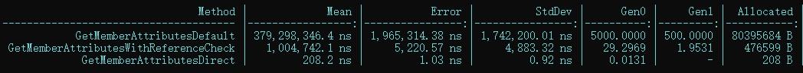

# DirectRetrieveAttribute


[](https://openupm.com/packages/com.bbbirder.directattribute/)

## 为什么有用
使用额外的全局元数据而不是反射遍历来实现Attribute获取。

可以满足以下三大常见需求：
* **高效**获取Attribute
* **高效**获取子类（提供basetype）和实现类（提供interface）
* 通过Attribute实例**直接获取**标记的类或成员

参考 [基准测试结果](#基准测试结果)

## 快速开始

### 安装
#### via Git URL
Package Manager通过git url安装： https://github.com/labbbirder/DirectRetrieveAttribute.git
#### via OpenUPM
```bash
openupm add com.bbbirder.directattribute
```
### 检索Attribute

```csharp
using com.bbbirder;

//自定义Attribute继承DirectRetrieveAttribute
class FooAttribute:DirectRetrieveAttribute {
    public string title { get; private set; }
    public FooAttribute(string title){
        this.title = title;
    }
    public override void OnReceiveTarget(){
        // targetType is available here
    }
}

//作出标记
[Foo("whoami")]
class Player{
    [Foo("Hello")]
    void Salute(){

    }
}

//检索当前Domain下所有FooAttribute
FooAttribute[] attributes = Retriever.GetAllAttributes<FooAttribute>(); 
foreach(var attr in attributes){
    print($"{attr.targetType} {attr.targetMember?.Name} {attr.title}"); 
}
// output: 
//    Player null whoami
//    Player Salute Hello
```

> 自定义Attribute需要继承`DirectRetrieveAttribute`。`Retriever.GetAllAttributes`会在检索过程中赋值目标类型`targetType`和成员`targetMember`并调用`OnReceiveTarget()`通知赋值完成。


### 检索子类型

```csharp
using com.bbbirder;

// 定义几个类型
[InheritRetrieve]
public class Battler{

}

public class Hero:Battler{

}

public class Titant:Hero{

}

// 获取Domain下所有Battler子类
Type[] types = Retriever.GetAllSubtypes(typeof(Battler));
foreach(var type in types){
    print($"{type.Name}");
}
// output:
//     Hero
//     Titant
```

接口的实现检索与上例类似。

## 传统方式对比
### 传统方式获取Attributes列表
在传统方式下，我们可能会这样获取所有自定义属性：
```csharp
AppDomain.CurrentDomain.GetAssemblies()
    .SelectMany(a=>a.GetTypes())
    .SelectMany(a=>a.GetMembers()
        .SelectMany(m=>m.GetCustomAttributes(attrType)))
    .ToArray();
```
> 众所周知，反射方法效率低，并且会产生大量GC。如果你是一个Package Developer，在你开发的众多Package中可能有不少需要检索Attribute列表的情况，这无疑是灾难性的。（参考[基准测试结果](#基准测试结果)）

### 基准测试结果

* `GetMemberAttributesDefault`使用传统方式检索所有Attribute，
* `GetMemberAttributesWithReferenceCheck`使用传统方式检索，但是先检查Assembly之间的依赖关系。
* `GetMemberAttributesDirect`使用Direct方式检索所有Attribute。

可以得出结论如下：

||运行时间| 内存消耗|每用户代码体积增长|
|--|--|--|--|
|传统方式|100%|100%|开销线性增加|
|Direct|<5%|<1%|开销几乎不变|

[基准测试源码](Documentation/benchmark.md)

值得一提的是，以上的结果还只是基于理论的测试，在实际应用中，DirectRetrieveAttribute因考虑到检索通常集中地发生在开始运行阶段，因此在内部做了一点小小的优化：使用WeakReference缓冲了一下中间计算。结果是，Direct方式开销小到无法察觉（见下图）！


实际差异如下：

||运行时间| 内存消耗|每用户代码体积增长|
|--|--|--|--|
|传统方式|100%|100%|开销线性增加|
|Direct|<0.1%|<0.1%|开销几乎不变|


## 实现原理
开发者编辑代码时使用源生成方式写入assembly Attribute列表（名为`GeneratedDirectRetrieveAttribute`），并提供RoslynAnalyzer保证代码准确性。

使用反编译工具打开Unity自动生成的Dll，可以看到类似下面的额外元数据：
```csharp
[assembly: GeneratedDirectRetrieve(typeof(global::Program))]
[assembly: GeneratedDirectRetrieve(typeof(global::Program),"Main")]
[assembly: GeneratedDirectRetrieve(typeof(com.Another.ns.Player<,>))]
[assembly: GeneratedDirectRetrieve(typeof(com.Another.ns.Player<,>),"age")]
[assembly: GeneratedDirectRetrieve(typeof(com.Another.ns.Player<,>),"Inner")]
[assembly: GeneratedDirectRetrieve(typeof(com.Another.ns.Player<,>.Inner))]
[assembly: GeneratedDirectRetrieve(typeof(com.Another.ns.IPlayer))]
[assembly: GeneratedDirectRetrieve(typeof(com.Another.ns.bbbirder))]
[assembly: GeneratedDirectRetrieve(typeof(com.Another.ns.labbbider))]
```
对于Inherit的Attribute，会额外记录他们的子类。

在运行时直接从全局元数据中获得`GeneratedDirectRetrieveAttribute`列表。
## 目录结构
大致目录如下：
* `Editor` :自动安装功能
* `Runtime` :运行时检索功能
* `VSProj~` :RoslynAnalyzer的源码
## Todo List
* ~~**支持 Inherit 参数**~~
* 还可以继续优化，但是收益不大；欢迎PR。
    * `GeneratedDirectRetrieveAttribute` 中增加目标Attribute字段
    * `#NET7_0_OR_GREATER` 宏判断和成员排序
    * 增加 `GeneratedDirectRetrieveAttribute` 数组的起始元信息，实现遍历早停。
* ~~Auto CI~~
## 常见问题
|Problem|Reason|Solution|
|:-:|:-|:-|
|打包后无法搜索到Attribute|Stripping Level 过高|降低Stripping Level或 [保留代码](https://docs.unity3d.com/Manual/ManagedCodeStripping.html)|

NOTE THAT : 传统方式也可能遇到上面的问题。而本库的未来版本可以忽略上面的问题（即自动保留用到的Attribute），当前版本请自己注意代码剥离问题。
